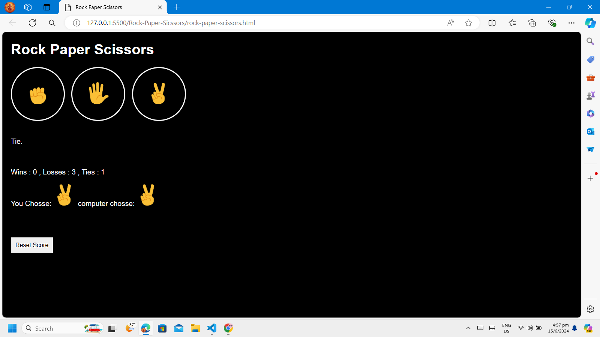

# Rock Paper Scissors Game

This is a simple Rock Paper Scissors game implemented using HTML, CSS, and JavaScript. Users can play the game against the computer, and their scores are saved in the local storage of their browser.

## Features

- **Play the Game**: Choose between Rock, Paper, and Scissors to play against the computer.
- **Score Tracking**: Keeps track of wins, losses, and ties.
- **Local Storage**: Saves the score locally so that it persists across page reloads.
- **Reset Score**: Option to reset the score to zero.

## How to Play

1. Open the `index.html` file in a web browser.
2. Click on the Rock, Paper, or Scissors button to make your move.
3. The computer will make its move, and the result will be displayed.
4. The score will be updated and displayed on the screen.
5. Click on the "Reset Score" button to reset your score.

## Files

- `index.html`: The main HTML file that contains the structure of the game.
- `style.css`: The CSS file that styles the game.
- `javascript.js`: The JavaScript file that contains the game logic.

## Code Overview

- **HTML**: Defines the structure of the game with buttons for Rock, Paper, and Scissors, and elements to display the result and score.
- **CSS**: Styles the buttons, images, and text to make the game visually appealing.
- **JavaScript**: Implements the game logic, including random move generation for the computer, score calculation, and interaction with local storage.

## JavaScript Functions

- `pickComputerMove()`: Generates a random move for the computer.
- `myMove(playerMove)`: Handles the player's move, updates the score, and displays the result.
- `updateScore()`: Updates the displayed score based on the current values.
- `resetScore()`: Resets the score to zero and clears the result display.

## Screenshots

Enjoy playing Rock Paper Scissors!
